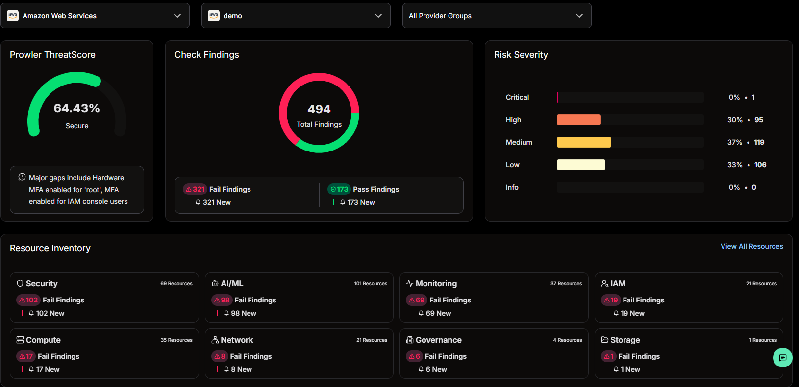
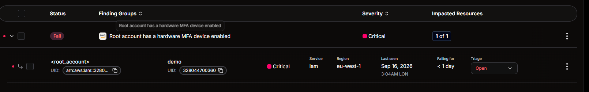
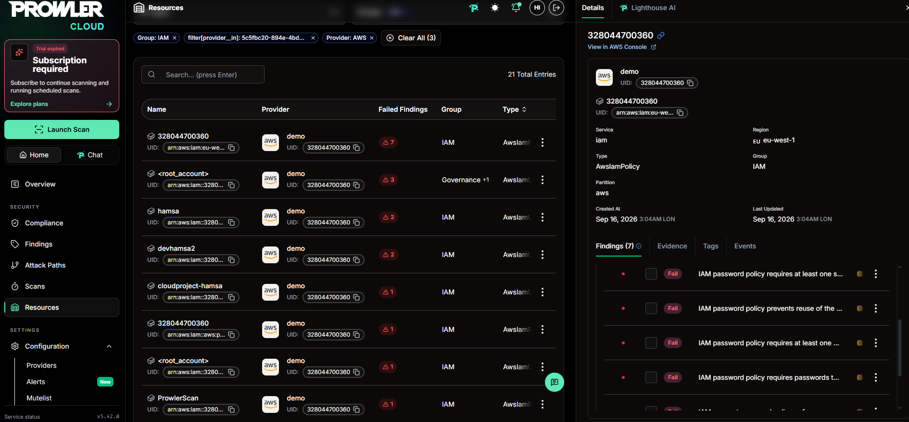
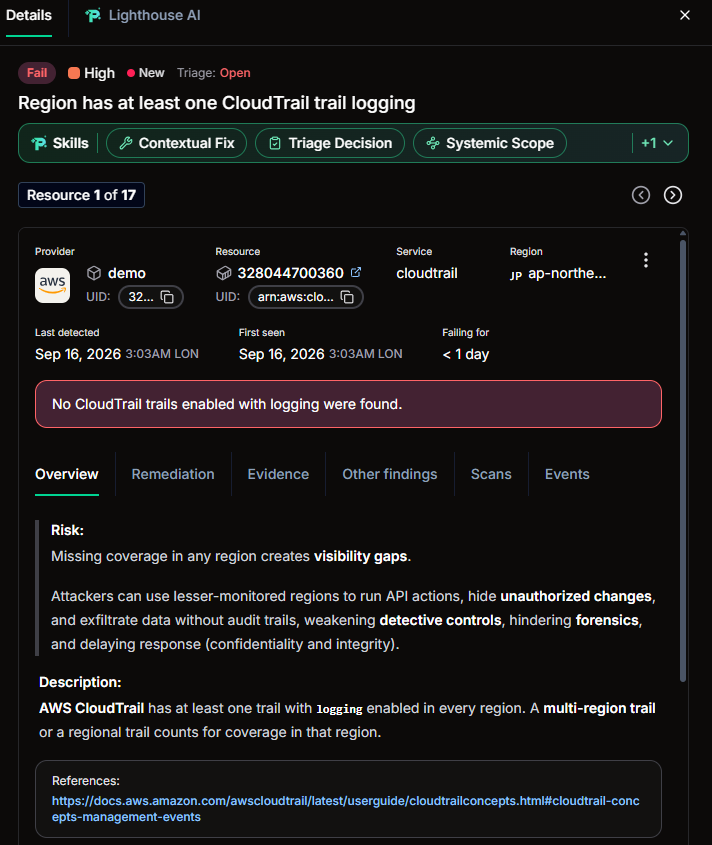
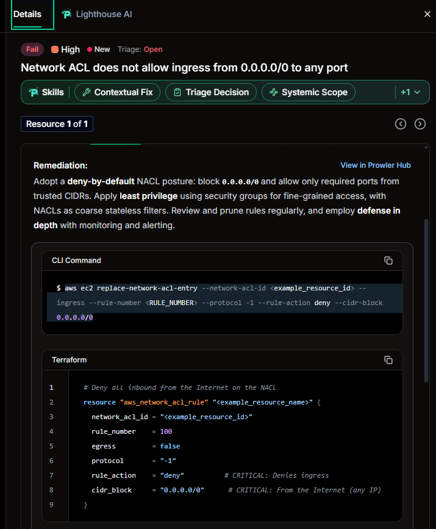

# AWS Security Posture Assessment — Prowler Cloud

## Overview

Ran an automated cloud security posture assessment against a personal AWS account using [Prowler Cloud](https://prowler.com), connected securely via an assumable IAM role (least-privilege, `SecurityAudit`-scoped, authenticated with an External ID to prevent confused-deputy access) rather than static access keys or root credentials.

The real value of a tool like Prowler isn't the scan itself — it's being able to take a list of flagged configurations and turn that into prioritized, business-relevant advice. This writeup focuses on that interpretation and reasoning, not just the raw output.

Initial scan: **64.43% secure**, 494 total findings (1 Critical, 95 High, 119 Medium, 106 Low, 173 Passing). A high initial fail count is typical for a freshly created AWS account — most defaults (encryption, MFA, logging) are opt-in, not on by default.

## Prioritization Framework

Findings weren't triaged purely by Prowler's severity label. Each one was assessed against:
1. **Prowler/CIS severity** as a baseline
2. **Real exposure** — internet-facing vs. internal, whether it touches sensitive data or identity
3. **Compensating controls already in place**
4. **Blast radius** — identity-related findings tend to have the widest reach, but that's a strong prior, not a rule

---

## Finding 1: Root Account Missing Hardware MFA (Critical)

**What it is:** The root account did not have a *hardware* MFA device — the check specifically tests for a physical device, not general MFA.

**Why it's labelled Critical:** Root is the single most privileged identity in the account; any gap here is scored by potential impact, not just likelihood.

**Risk-based interpretation:** App-based MFA (Google Authenticator) was already enabled on root before this scan, which closes the majority of real-world risk — an attacker still needs both a password and the authenticator app. The check is specifically a **CIS Level 2** control (hardware MFA), which is stricter than the Level 1 baseline (any MFA). Level 2 controls are optional-by-design, trading cost/usability for higher assurance, most relevant where phishing-resistance is a priority.

**Decision:** Treated as an accepted residual risk for a personal/learning account rather than purchasing a hardware key. In a production environment handling sensitive data, hardware MFA on root and other highly-privileged accounts would be recommended given the stakes.

**Framework mapping:** CIS AWS Foundations Benchmark v3.0 — 1.5/1.6 · ISO 27001:2022 Annex A.5.17 (Authentication information), A.8.5 (Secure authentication) · NIST CSF PR.AC-7

---

## Finding 2: No Account-Wide IAM Password Policy (High)

**What it is:** A single IAM resource showing 7 failed findings — no minimum password length, no complexity requirement, no reuse prevention. All 7 stem from one root cause: AWS does not configure an IAM password policy by default.

**Why it matters:** Weak or reused passwords on IAM users are a common initial access vector; a password policy is the baseline control that prevents this at the account level.

**Remediation:** IAM Console → Account settings → Password policy — set minimum length 14, require upper/lowercase/number/symbol, enable reuse prevention.

**Framework mapping:** CIS AWS Foundations Benchmark v3.0 — 1.8–1.11 · ISO 27001:2022 Annex A.5.17 · NIST CSF PR.AC-1

---

## Finding 3: CloudTrail Not Logging in Every Region (High)

**What it is:** At least one AWS region had no CloudTrail trail with logging enabled covering it.

**Why it matters:** Any unmonitored region is a visibility gap — activity there (legitimate or malicious) leaves no audit trail, undermining detection and forensic investigation after the fact.

**Context from prior project work:** Having previously built a CloudTrail → CloudWatch → SNS monitoring pipeline, this finding was immediately recognisable as a likely case of a trail being scoped to a single region rather than configured as multi-region — an easy oversight when the initial focus is on getting a trail working rather than its regional coverage.

**Remediation:** CloudTrail Console → Trails → confirm "Apply trail to all regions" is set to Yes on the existing trail, rather than creating a new one.

**Framework mapping:** CIS AWS Foundations Benchmark v3.0 — 3.1 · ISO 27001:2022 Annex A.8.16 (Monitoring activities) · NIST CSF DE.CM-1

---

## Finding 4: Network ACL Allows Unrestricted Ingress from 0.0.0.0/0 (High)

**What it is:** A Network ACL allowed ingress from any IP address on any port — the check title states the secure condition ("does not allow ingress from 0.0.0.0/0 to any port"), so a Fail means the opposite is true.

**Why it matters — defense in depth:** NACLs are a distinct, subnet-level control layer, separate from (and stateless compared to) security groups. A fully open NACL removes a backstop: even a perfectly configured security group offers no protection if the coarser NACL layer above it allows everything through.

**Catching a flawed automated remediation suggestion:** Prowler's own suggested CLI and Terraform remediation (shown above) uses `protocol = -1` (all protocols, all ports) and an arbitrary rule number, with no awareness of the account's actual existing rule ordering or which ports are genuinely needed. Applying it as-is risked either:
- Blocking legitimate traffic if the subnet is meant to be reachable on specific ports, or
- Having no effect at all, since NACLs evaluate rules in ascending order and stop at the first match — if the existing overly-permissive allow rule sits at a lower rule number, a new deny rule placed afterward would never be evaluated

**Correct approach:** Run `aws ec2 describe-network-acls` first to review existing rule numbers and ordering, then either scope the allow rule down to only the ports genuinely required, or remove the offending broad allow rule outright (NACLs deny by default once no allow rule matches).

**Why this matters more broadly:** Automated tools are strong at detection but their generic remediation suggestions still require human judgement applied against the real environment — this is precisely where interpretation adds value beyond just running a scan.

**Framework mapping:** CIS AWS Foundations Benchmark v3.0 — Networking (5.x) · ISO 27001:2022 Annex A.8.20 (Network security controls) · NIST CSF PR.AC-5

---

## Summary

| Finding | Severity | Status | Framework (CIS / ISO 27001 / NIST CSF) |
|---|---|---|---|
| Root account missing hardware MFA | Critical | Risk accepted (app-based MFA already in place) | 1.5/1.6 · A.5.17, A.8.5 · PR.AC-7 |
| No account-wide IAM password policy | High | Remediated | 1.8–1.11 · A.5.17 · PR.AC-1 |
| CloudTrail not logging in every region | High | Remediated | 3.1 · A.8.16 · DE.CM-1 |
| Network ACL open to 0.0.0.0/0 | High | Remediation identified; flawed tool suggestion corrected | 5.x · A.8.20 · PR.AC-5 |

The remaining Medium/Low findings (largely logging and resource-tagging hygiene) were reviewed collectively rather than individually, as they carried limited standalone risk relative to the findings above.

## Key Takeaway

The value of a posture-assessment tool isn't the list of findings it produces — it's the ability to interpret those findings with real-world context, prioritize by actual risk rather than raw severity labels, and apply informed judgement to (and where necessary, correct) automated remediation suggestions before acting on them.
