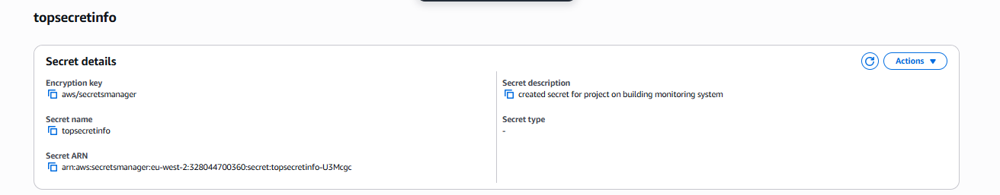
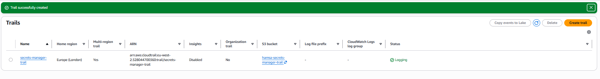
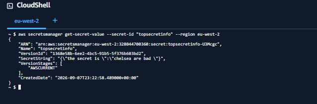
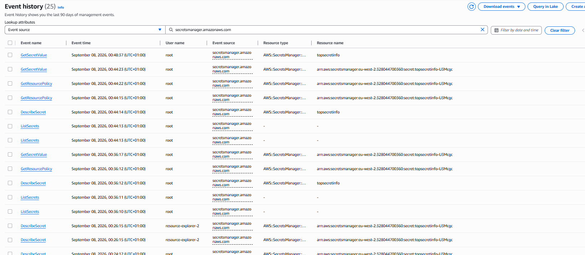
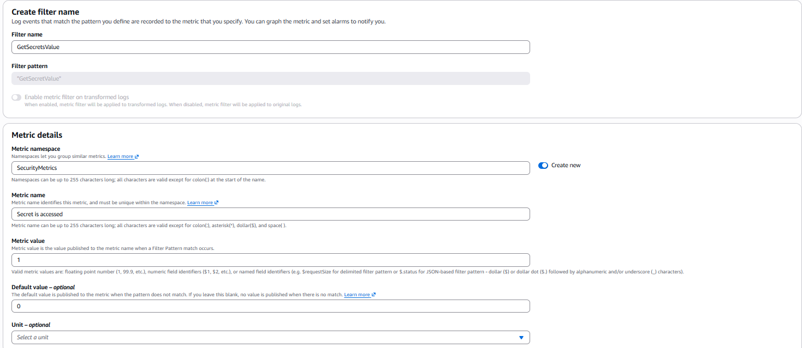
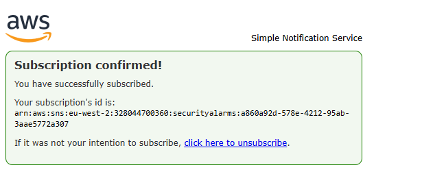
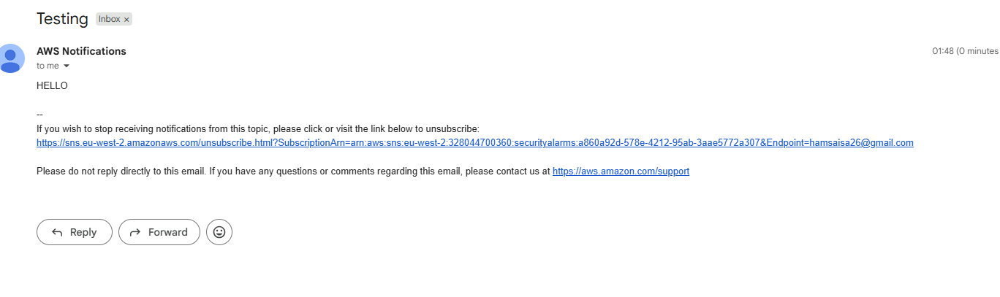
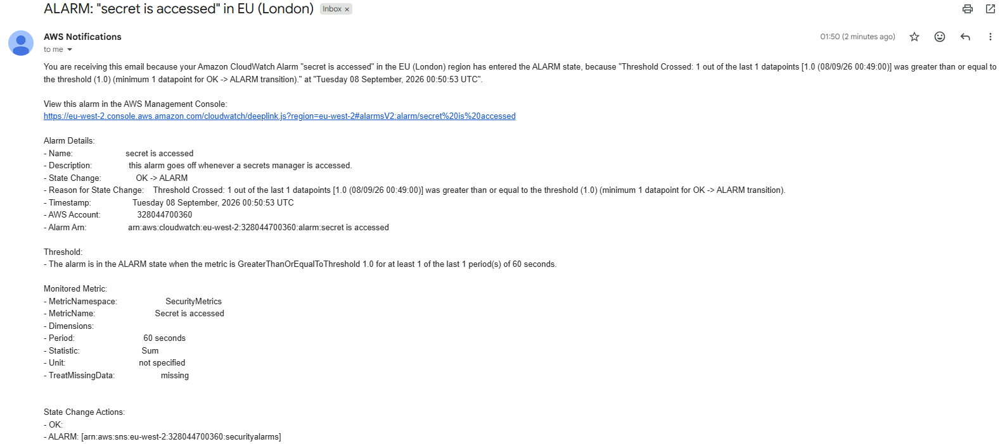
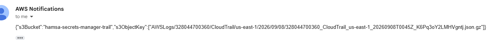

# Build a Security Monitoring System on AWS

**CloudTrail | CloudWatch | SNS**

## Overview

I built a monitoring system that detects when a secret in AWS Secrets Manager is accessed, and sends a real-time email alert when it happens — using CloudTrail for logging, CloudWatch for filtering and alarming, and SNS for notification.

## Step 1: Create a Secret

I created a secret in Secrets Manager — the resource I want to monitor access to for the rest of the project.

**Why:** This is the thing we're protecting — everything else in this project exists to detect and alert on access to it.

## Step 2: Configure CloudTrail

I set up a CloudTrail trail to track account activity — specifically Management events, since accessing a secret falls into that category and is free to track.

**Why:** CloudTrail is the "eyes" of the account — without it, nothing downstream has anything to detect.

## Step 3: Generate and Verify Secret Access Events

To test whether CloudTrail was actually working, I accessed the secret via the AWS CLI, triggering the `GetSecretValue` API call directly.

I then checked CloudTrail's Event History and confirmed the `GetSecretValue` event was captured.

**Why:** This confirms CloudTrail actually caught the access — proving the pipeline before building anything on top of it.

## Step 4: Track Secret Access Using CloudWatch

I created a CloudWatch metric filter to turn matching CloudTrail log lines into a trackable number.

Filter pattern: `"GetSecretValue"` | Metric value: `1` | Default value: `0`

**Why:** The filter turns a raw log line into a countable metric — this is what the alarm in the next step actually watches.

## Step 5: Create CloudWatch Alarm and SNS Topic

I created an alarm that triggers when the metric crosses a threshold of 1, and an SNS topic to email me when that happens.

**Why:** AWS requires this confirmation step so nobody can be subscribed to notifications without their consent.

## Step 6: Test and Troubleshoot

On the first end-to-end test, no email arrived — even though everything looked correctly configured. I worked through the pipeline step by step to isolate the fault:

1. Checked CloudTrail's Event History again — the access was being logged correctly.
2. Checked the trail's delivery status to CloudWatch — logs were arriving in the log group as expected.
3. Tested the metric filter directly against sample log data — it correctly matched only `GetSecretValue` events.
4. Manually forced the alarm into ALARM state via the CLI — this successfully sent an email, confirming the alarm-to-SNS link worked.
5. Published a raw test message directly to the SNS topic, bypassing CloudWatch entirely — confirming SNS itself could deliver messages.

With every individual link confirmed working, the fault had to be in how the alarm evaluated the metric. The alarm's statistic was set to **Average** instead of **Sum** — so one access in a 60-second period came out as a tiny fraction (around 0.002) that never crossed the threshold of 1. Switching the statistic to Sum fixed the calculation.

**Why:** Isolating each link in the chain rather than guessing is the same evidence-based process used when investigating why a security alert isn't firing as expected.

### Final Test: Success

I accessed the secret one more time and confirmed the alarm now fired correctly, with the alert email arriving within minutes.

## Bonus: CloudTrail Direct-to-SNS Comparison

As an extension, I enabled CloudTrail's built-in direct SNS notification option, which bypasses CloudWatch entirely.

**Why:** This showed why CloudWatch's targeted alarm is the better design: direct notifications fire on every single log delivery with no filtering, while the CloudWatch alarm only alerts on the exact event that actually matters.

## Result

The system successfully detects secret access and sends a real-time email alert — built and verified end-to-end, including diagnosing and fixing a real configuration error along the way.

## Key Takeaway

A working pipeline isn't proven by configuration alone — it's proven by testing. Isolating each stage (logging → filtering → alarming → notification) individually was what actually found the fault, a statistic mismatch that would have been easy to miss by just re-checking the same settings repeatedly.
