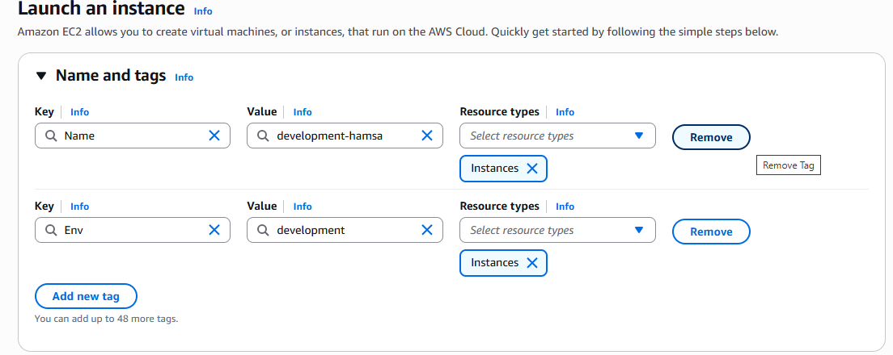
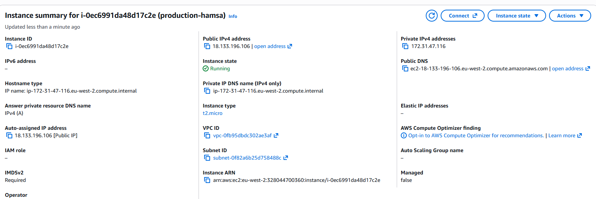
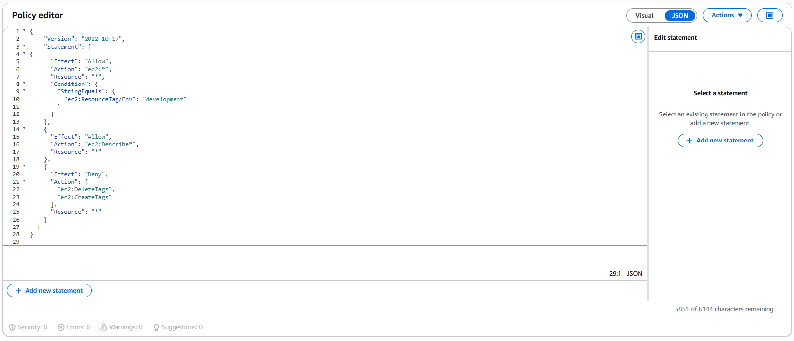
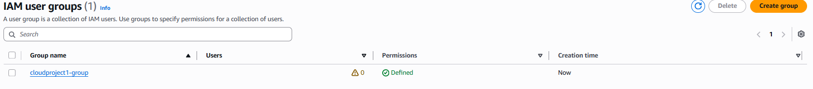
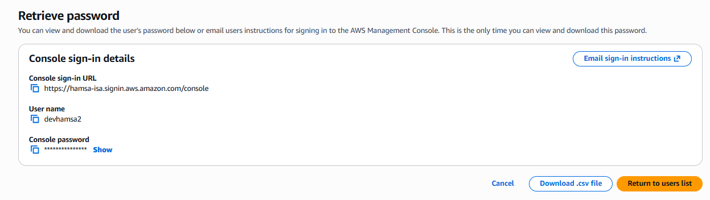
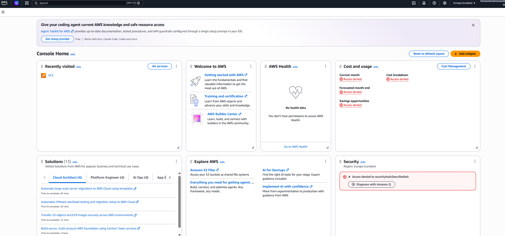
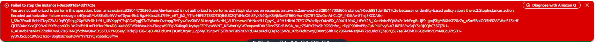
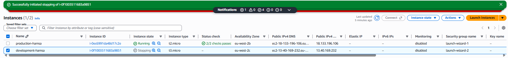

# Enhance Cloud Security with AWS IAM

## Overview

As acting security engineer for "NextWork," I set up an AWS environment where a new, restricted user (representing a summer intern) could work freely in a development environment — but was completely blocked from touching production. I built and tested this end-to-end using a custom, tag-based IAM policy.

The core idea: rather than granting or denying access by resource ID (which breaks the moment new resources are created), the policy targets resources by an `Env` tag — so the rule automatically applies to any instance carrying that tag, now or in future.

## Step 1: Tag the EC2 Instances

I launched two EC2 instances and tagged each one by environment: `production-hamsa` (`Env: production`) and `development-hamsa` (`Env: development`).

**Why:** Tags let the IAM policy target resources by label instead of by ID — so the rule works on any instance carrying that tag, now or in future.

## Step 2: Write the IAM Policy

I wrote a custom JSON policy with three statements:

- **Allow** `ec2:*` only if `Env = "development"`
- **Allow** `ec2:Describe*` on everything (read-only view)
- **Deny** `CreateTags` / `DeleteTags` on everything

**Why:** The first rule grants full control over development only. The second lets the user still see production without touching it. The third stops anyone bypassing the whole thing by simply re-tagging production as "development" — without it, a user could relabel `production-hamsa` as `Env: development` and the first Allow statement would grant them full control over it.

## Step 3: Create an Account Alias

I created a custom sign-in URL for the account: `https://hamsa-isa.signin.aws.amazon.com/console`

**Why:** Purely a usability step — it makes the login link easy to share with a new user. It has no effect on permissions or security.

## Step 4: Create the User Group and User

I created a group — `cloudproject1-group` — attached the policy to it, then created a user, `devhamsa2`, and added them to the group.

**Why:** Assigning permissions at group level means any future user added to this group inherits the same access automatically — no need to configure each user individually.

## Step 5: Test the Restricted User

I didn't assume the policy worked — I logged in as the actual restricted user, `devhamsa2`, and proved both outcomes myself.

**Why:** I didn't assume the policy worked — I logged in as the actual restricted user and proved both outcomes myself: blocked on production, allowed on development.

## Result

`devhamsa2` could stop the development instance, but was denied on production — entirely by design, enforced through the tag-based IAM policy, group, and account alias set up above.

## Key Takeaway

A tag-based conditional policy is more resilient and scalable than an ID-based one, but only if it closes the obvious bypass: the ability to simply re-tag a resource to satisfy the policy's own condition. Explicitly denying tag modification alongside the conditional Allow is what actually makes the boundary hold.
